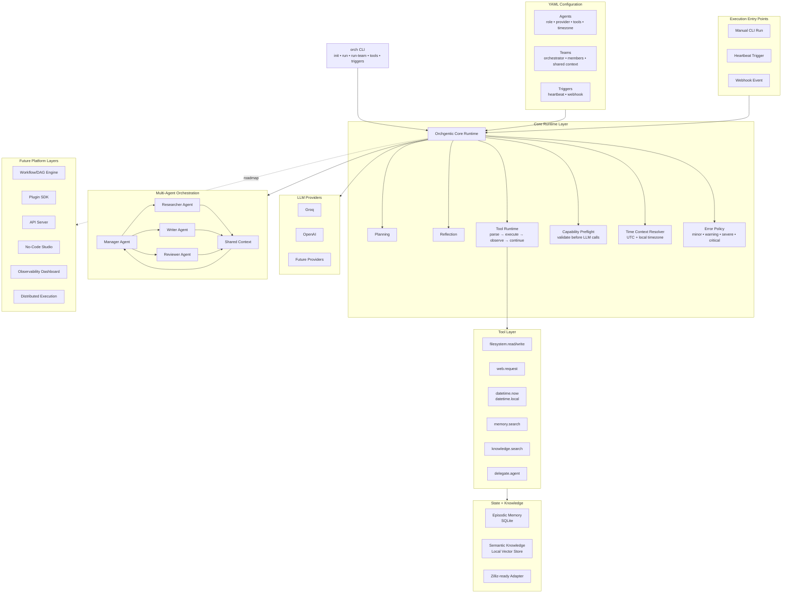

# Orchgentic Architecture Diagram

```mermaid
flowchart TD
    CLI["orch CLI<br/>init • run • run-team • tools • triggers"] --> Core["Orchgentic Core Runtime"]

    subgraph Config["YAML Configuration"]
        Agents["Agents<br/>role • provider • tools • timezone"]
        Teams["Teams<br/>orchestrator • members • shared context"]
        Triggers["Triggers<br/>heartbeat • webhook"]
    end

    Config --> Core

    subgraph Runtime["Core Runtime Layer"]
        Core --> Planner["Planning"]
        Core --> Reflection["Reflection"]
        Core --> ToolLoop["Tool Runtime<br/>parse → execute → observe → continue"]
        Core --> Preflight["Capability Preflight<br/>validate before LLM calls"]
        Core --> TimeContext["Time Context Resolver<br/>UTC + local timezone"]
        Core --> Errors["Error Policy<br/>minor • warning • severe • critical"]
    end

    subgraph Providers["LLM Providers"]
        Groq["Groq"]
        OpenAI["OpenAI"]
        FutureProviders["Future Providers"]
    end

    Core --> Providers

    subgraph Tools["Tool Layer"]
        FileTools["filesystem.read/write"]
        WebTool["web.request"]
        DateTools["datetime.now<br/>datetime.local"]
        MemoryTool["memory.search"]
        KnowledgeTool["knowledge.search"]
        DelegateTool["delegate.agent"]
    end

    ToolLoop --> Tools

    subgraph State["State + Knowledge"]
        Memory["Episodic Memory<br/>SQLite"]
        Knowledge["Semantic Knowledge<br/>Local Vector Store"]
        Zilliz["Zilliz-ready Adapter"]
    end

    Tools --> State

    subgraph Orchestration["Multi-Agent Orchestration"]
        Manager["Manager Agent"]
        Researcher["Researcher Agent"]
        Writer["Writer Agent"]
        Reviewer["Reviewer Agent"]
        SharedContext["Shared Context"]
    end

    Core --> Orchestration
    Manager --> Researcher
    Manager --> Writer
    Manager --> Reviewer
    Researcher --> SharedContext
    Writer --> SharedContext
    Reviewer --> SharedContext
    SharedContext --> Manager

    subgraph EntryPoints["Execution Entry Points"]
        Manual["Manual CLI Run"]
        Heartbeat["Heartbeat Trigger"]
        Webhook["Webhook Event"]
    end

    EntryPoints --> Core

    subgraph Future["Future Platform Layers"]
        DAG["Workflow/DAG Engine"]
        Plugins["Plugin SDK"]
        API["API Server"]
        Studio["No-Code Studio"]
        Observability["Observability Dashboard"]
        Distributed["Distributed Execution"]
    end

    Core -. roadmap .-> Future
```
