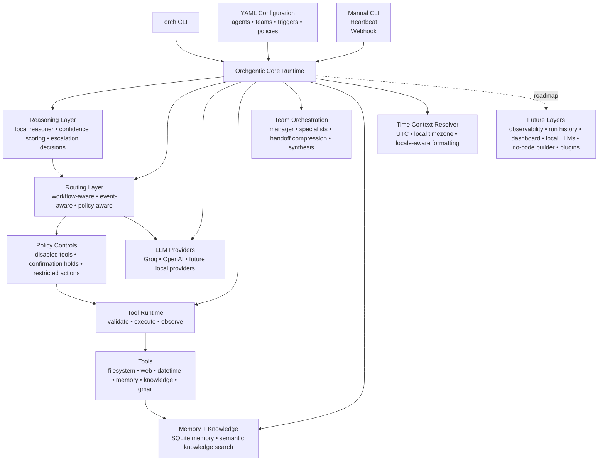

## Architecture Overview

Orchgentic is organized around a CLI-first, YAML-configured orchestration runtime that connects agents, providers, reasoning, routing, policies, tools, memory, knowledge, triggers, and multi-agent teams.

### What the architecture does

Orchgentic is not just an agent runner. It is the orchestration layer that decides how work should move through an agentic system.

At runtime, Orchgentic can:

- Load agents, teams, tools, policies, memory, and knowledge from YAML configuration.
- Use local reasoning to decide whether a task can avoid an external LLM call.
- Score confidence and escalate to the configured provider only when needed.
- Route tasks through deterministic tools, workflows, policies, or teams.
- Block disabled tools before LLM escalation or execution.
- Hold sensitive actions for confirmation.
- Coordinate team members and compress handoffs to reduce token usage.
- Produce debug output that explains routing, policy, tool, and team decisions.

### Current architecture focus

The v0.7.12 architecture focuses on:

- Local reasoning before provider calls
- Workflow-aware routing
- Event-aware routing
- Policy-aware escalation
- Tool safety and confirmation controls
- Team handoff compression
- Clean final team synthesis
- Debug visibility for developers

### Where the architecture is headed

The next major architecture layer is observability. Future versions are expected to add run history, routing traces, tool call traces, policy decision logs, team handoff traces, token savings estimates, and dashboard-ready event records.
