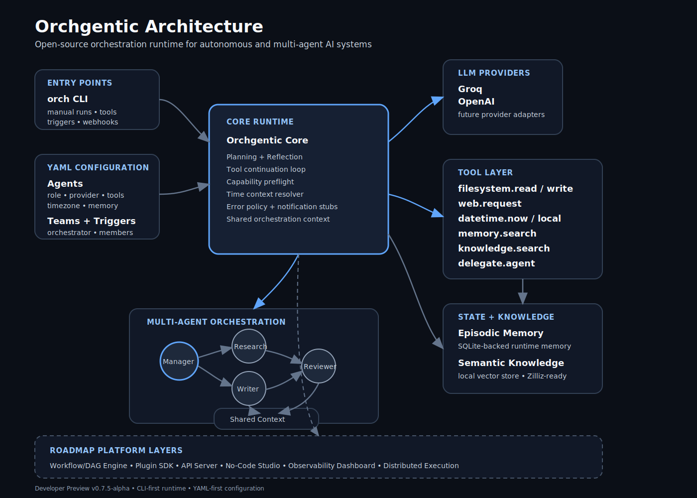
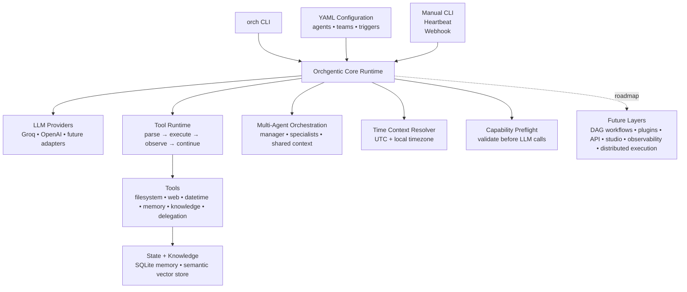

## Architecture Overview

Orchgentic is organized around a CLI-first, YAML-configured runtime that connects agents, providers, tools, memory, knowledge, triggers, and multi-agent orchestration.

```mermaid
flowchart TD
    CLI["orch CLI"] --> Core["Orchgentic Core Runtime"]

    Config["YAML Configuration<br/>agents • teams • triggers"] --> Core

    Core --> Providers["LLM Providers<br/>Groq • OpenAI • future adapters"]
    Core --> ToolLoop["Tool Runtime<br/>parse → execute → observe → continue"]
    Core --> Orchestration["Multi-Agent Orchestration<br/>manager • specialists • shared context"]
    Core --> TimeContext["Time Context Resolver<br/>UTC + local timezone"]
    Core --> Preflight["Capability Preflight<br/>validate before LLM calls"]

    ToolLoop --> Tools["Tools<br/>filesystem • web • datetime • memory • knowledge • delegation"]
    Tools --> State["State + Knowledge<br/>SQLite memory • semantic vector store"]

    Entry["Manual CLI<br/>Heartbeat<br/>Webhook"] --> Core

    Core -. roadmap .-> Future["Future Layers<br/>DAG workflows • plugins • API • studio • observability • distributed execution"]
```
